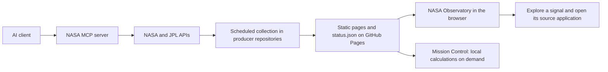

# Design System — RYASTRA NASA Data Fleet

**Version:** 1.0 · **Documented:** 2026-09-28 · **Reference application:** [NASA Observatory](https://ryastra.github.io/nasa-observatory/)

This document records the shared visual language already implemented across RYASTRA's NASA applications, using NASA Observatory as the main reference. It follows the supplied nine-section design-system template. Values described as **implemented** come from the current source; **standards** describe requirements for future changes and do not imply a completed accessibility audit.

### Business case and application context

RYASTRA began with a need to access NASA's separate APIs through one interface. The [NASA MCP server](https://github.com/RYASTRA/nasa-mcp) provides that interface for AI tools. The project then grew into focused applications for exploring NASA data and tracking meaningful changes, with the Observatory providing one place to discover them.

The deployed Observatory is a static HTML, CSS, and JavaScript application. Its browser reads seven public `status.json` records; each producer owns its data collection, wording, and freshness window. The MCP is the research and exploration foundation, while the production fleet's collectors call their upstream services directly. The Observatory does not call the MCP or an LLM at runtime.

The seven applications cover space weather, planetary defense, technology transfer, space biology, exoplanets, citizen science, and imagery. Schedules differ by domain. The Observatory checks their records every 15 minutes; that interval does not mean NASA datasets themselves update every 15 minutes.

## 1. Brand Principles

RYASTRA should feel like a calm, credible observatory: curious about space, precise about evidence, and welcoming to people who are not scientists. A dark sky, restrained orbital graphics, and bright data accents establish the theme while clear labels, source links, and visible freshness keep the information understandable. Every application identifies itself as an independent project and preserves the distinction between measured data, predictions, uncertainty, and unavailable information.

## 2. Color Palette

### Core palette — implemented

| Name / CSS token | Hex | Use |
|---|---|---|
| Night / `--night` | `#050812` | Page background and dark canvas |
| Panel / `--panel-solid` | `#10182C` | Cards and raised data surfaces |
| Primary text / `--ink` | `#F4F7FF` | Headings, key values, body text |
| Supporting text / `--ink-soft` | `#C4CDE0` | Descriptions and secondary links |
| Muted text / `--ink-muted` | `#8C98B0` | Timestamps, labels, supporting metadata |
| Primary accent / `--cyan` | `#66E3FF` | Primary actions, links, identity accents |
| Secondary accent / `--violet` | `#A995FF` | Exoplanet theme and decorative highlights |

### Semantic colors — implemented

| Token | Hex | Meaning |
|---|---|---|
| `--green` | `#79E6BD` | Live status; biology and citizen-science accents |
| `--amber` | `#FFD479` | Stale status, keyboard focus; solar-weather and imagery accents |
| `--red` | `#FF9B9B` | Degraded status and error emphasis |

Use the semantic label alongside its color. An amber imagery card identifies a subject; the word **stale** identifies a data state. Neither a card's theme nor a colored dot alone should imply a warning.

Existing supporting tokens include `--night-raised: #0A1020`, `--panel-hover: #15213B`, and `--cyan-bright: #A5F1FF`. Borders use `rgba(164, 184, 224, 0.18)` and stronger borders use the same RGB values at `0.35` opacity. Soft accent fills use the existing 12–14% opacity variants. Reuse these tokens instead of adding near-duplicate colors.

Primary buttons pair cyan with `#06101A` text. Gradients and star fields remain behind content and must preserve readable contrast.

## 3. Typography

The interface uses a system sans-serif stack for reading and a system monospace stack for telemetry. Inter is the first preference in the CSS, but the Observatory does not download an Inter font file; the available system fallback therefore determines the rendered face.

- **Sans-serif:** `Inter, ui-sans-serif, system-ui, -apple-system, BlinkMacSystemFont, "Segoe UI", sans-serif`.
- **Monospace:** `"SFMono-Regular", Consolas, "Liberation Mono", monospace`.
- **Existing display exception:** the emphasized phrase in the hero uses italic Georgia, with Times New Roman and serif fallbacks. Keep this third style confined to that short phrase; ordinary headings and reading text use sans-serif.

Sizes below assume the browser's default 16px root size. Keep `rem` and `clamp()` values in implementation so text can scale.

| Role | Font | Implemented size | Weight / treatment |
|---|---|---|---|
| Hero H1 | Sans-serif | `clamp(3.15rem, 7.4vw, 6.8rem)` | 780; line-height 1.08 |
| Hero emphasis | Georgia | Inherits H1 | 500; italic; cyan-to-lavender treatment |
| Section H2 | Sans-serif | `clamp(2.1rem, 4.8vw, 4rem)` | 780; line-height 1.08 |
| Project-card H3 | Sans-serif | `1.5rem` / 24px | 780 |
| Body | Sans-serif | `1rem` / 16px | Regular; line-height 1.62 |
| Card summary | Sans-serif | `0.94rem` / about 15px | Regular; line-height 1.48 |
| Card metric value | Monospace | `1.04rem` / about 17px | 720; tabular numerals |
| Metadata | Mostly monospace | Commonly `0.63–0.78rem` | Compact labels; avoid long passages |

Below 40rem, H1 uses `clamp(2.8rem, 14vw, 4.7rem)` and H2 uses `clamp(2rem, 10vw, 3.1rem)`. Existing metadata can be small; use at least `0.75rem` for new supporting text where space permits, and verify readability under zoom. This is a future design rule, not a claim that every existing label already meets it.

## 4. Logo Usage

- **Asset:** [Observatory orbital favicon, SVG](https://ryastra.github.io/nasa-observatory/assets/favicon.svg). Its square `64 × 64` viewBox allows crisp scaling.
- **Wordmark:** the header renders “NASA Observatory” as text, with Observatory in cyan and a small cyan ring drawn by `.brand::before`. There is no separate wordmark image to stretch or replace.
- **Placement:** use the wordmark as the home link in the header and as identity in the footer. Preserve its readable accessible name, “NASA Observatory home.”
- **Usage rules:** preserve the SVG's aspect ratio, colors, and dark background; keep it clear of data labels and busy imagery. For new placements, leave clear space of at least one small ring diameter.
- **Attribution:** retain “An independent view across public NASA data, built and operated by RYASTRA. Not affiliated with or endorsed by NASA.” Do not replace the RYASTRA identity with an official NASA insignia or imply endorsement.
- **NASA imagery:** retain descriptive captions and links to the original NASA record. The image is content, not a substitute for the application identity.

## 5. Spacing & Grid

Use a 4px planning unit for new spacing, with a preferred scale of **4 / 8 / 12 / 16 / 20 / 24 / 32 / 48 / 64px**. The existing CSS uses fluid values and optical adjustments rather than a strictly enforced spacing-token scale; preserve those values when documenting the current interface.

| Element | Implemented layout |
|---|---|
| Content container | `min(calc(100% - 2rem), 78rem)`; centered; up to 1248px |
| Sibling applications | Several earlier fleet apps use a 76rem maximum; Observatory, Mission Control, and Imagery use 78rem |
| Section spacing | `clamp(4.5rem, 8vw, 7.5rem)` vertically; 4rem below 40rem |
| Fleet grid | Three equal columns; 1rem / 16px gaps |
| Medium screens | At or below 68rem / 1088px, fleet grid becomes two columns |
| Narrow screens | At or below 40rem / 640px, fleet grid becomes one column |
| Page gutters | 1rem each side normally; 0.625rem each side below 40rem |
| Card padding | 1.25rem / 20px normally; 1rem below 22rem |
| Hero and method layout | Stack at or below 52rem / 832px; hero metrics become two columns |
| Imagery card | Spans the whole fleet grid; five preview columns on wider screens, horizontal preview strip below 52rem |

The header remains sticky. Section links allow `5.5rem` of scroll clearance. Narrow navigation scrolls horizontally; do not hide destination links to make the header fit. Keep essential card content in the normal reading order when layouts stack.

Radius tokens are `0.55rem` for controls, `0.9rem` for inset panels, and `1.35rem` for large cards. Fully rounded badges use `999px`.

## 6. Core Components

| Component | Rules |
|---|---|
| Primary button | Cyan background, dark text, small radius, minimum height `2.9rem`, padding `0.65rem 1rem`, weight 750. Use a concrete action such as “Open live network.” |
| Secondary button | Subtle translucent fill, strong border, supporting text. Hover gains cyan emphasis. The compact refresh variant uses `2.6rem` minimum height and `0.48rem 0.8rem` padding. |
| Busy action | “Refresh signals” becomes “Refreshing…” and is disabled while requests are in progress. Restore the label and enabled state when all requests settle. |
| Fleet card | Large radius, 1px subtle border, dark gradient surface, 20px padding. Order: project identity and state, title, headline, metrics, events or empty message, freshness, destination link. |
| Metrics | Semantic description list (`dl`, `dt`, `dd`). Pair every value with a visible label. Preserve source units and use tabular numerals. |
| Event row | Date/time in a separate column, concise text beside it, optional HTTPS source link. Do not repeat the displayed timestamp inside the item text. |
| Status badge | A colored dot plus visible text: connecting, live, stale, degraded, or no signal. Domain accents do not replace these labels. |
| Imagery preview | Captioned, linked thumbnail with lazy loading. If an image fails, retain the NASA fallback, caption, and usable link. A captioned link supplies the accessible name; the duplicate thumbnail has empty alt text. |
| Navigation | Sticky brand/home link and named destinations. Indicate links that open a new tab, including in the accessible label. Use links for navigation and buttons for actions. |
| Countdown | Monospace, tabular numerals, UTC target, and visible units. It is calculated from the device clock; it is not a live orbit solution. |
| Form field — sibling pattern | Observatory has no entry form. Mission Control uses a label above a full-width dark input, 1px strong border, small radius, and `2.75rem` minimum height. Invalid input receives `aria-invalid` and red emphasis; errors must also explain the correction in text. |
| Empty / unavailable state | “No recent events” is a valid result. A failed record displays “Signal unavailable” and retains the link to the producer application. Never render a missing measurement as a reassuring zero. |

### State and content contract

The Observatory validates schema version 1 and the expected project identity before rendering a record. Each record supplies `title`, `site`, `updated_utc`, `fresh_for_hours`, `ok`, `headline`, `metrics`, and `items`.

- A headline is at most 120 characters; there are 1–4 metrics and at most five items; each item text is at most 140 characters.
- `updated_utc` represents the producer's data refresh, not a cosmetic redeploy. Each producer chooses its freshness window.
- A valid record with `ok: false` is **degraded**. Otherwise, age beyond `fresh_for_hours` is **stale**; a valid record inside that window is **live**. An invalid, missing, or timed-out record becomes **no signal**.
- Mission Control publishes an on-demand capability record with a long freshness window. Its “live” badge does not mean a new observing forecast was fetched at that moment.
- A fetch has a 12-second timeout. Cards load independently, and one failed endpoint does not prevent the remaining cards from rendering.
- The page refreshes every 15 minutes and on demand. Freshness labels are reevaluated every 30 seconds. Loading, healthy empty results, and errors must remain visually distinguishable.

## 7. Voice & Tone

Use clear, brief, curious language. Lead with what the visitor can learn or do, then provide the evidence and source. Scientific terms can remain where useful, but labels should explain the meaning or unit without requiring specialist knowledge.

| Situation | Preferred wording |
|---|---|
| Open an application | “Explore NASA tech” or “Open weather watch” |
| Refresh | “Refresh signals” → “Refreshing…” |
| Valid empty result | “The latest signal contains no high-priority solar-weather events.” |
| Missing feed | “Signal unavailable”; retain a route to the application |
| Prediction | Identify it as a forecast, include the relevant time and uncertainty |
| Data provenance | Show when the data was updated and link to the source |

Avoid alarmist copy about asteroids, guaranteed aurora visibility, or claims that a planet is habitable when the evidence only concerns a screening criterion. Keep space-themed language in headings; status messages should state what happened. Label UTC explicitly wherever timing could be ambiguous.

## 8. Accessibility Standards

**Target:** [WCAG 2.2 Level AA](https://www.w3.org/WAI/WCAG22/quickref/). This is a maintenance requirement; the present review is not a full conformance certification.

- **Text contrast:** at least 4.5:1 for ordinary text and 3:1 for qualifying large text. Check the final composited background when gradients or transparency are involved. [W3C contrast guidance](https://www.w3.org/WAI/WCAG22/Understanding/contrast-minimum.html)
- **Controls and states:** essential visual control boundaries and state indicators should meet 3:1 against adjacent colors. Status must be conveyed with text as well as color.
- **Keyboard:** keep all actions keyboard-operable with a visible focus indicator. The implemented focus ring is 3px amber with a 3px offset; preserve the skip link and avoid obscuring focus under the sticky header.
- **Target size:** meet the WCAG 2.2 AA minimum of 24 × 24 CSS pixels or its applicable spacing exceptions. Prefer 44 × 44px for primary touch controls. [W3C target-size guidance](https://www.w3.org/WAI/WCAG22/Understanding/target-size-minimum.html)
- **Structure and feedback:** maintain one H1, ordered headings, named navigation, and semantic lists. The network summary uses `role="status"` with polite announcements; the grid uses `aria-busy`. Keep keyboard focus stable when cards refresh.
- **Motion and display preferences:** retain `prefers-reduced-motion`, increased-contrast, and forced-colors support. Decorative orbital graphics are hidden from assistive technology. Check continuous animation and updating content against pause/stop requirements during a full audit.
- **Reflow:** verify reading and operation at 320 CSS pixels and 200% text zoom. Test the scrolling navigation and imagery strip with keyboard and touch. Small metadata, translucent borders, and placeholder text need special attention.

### Token contrast spot checks

Calculated from the sRGB token values using WCAG relative luminance; these results cover solid pairs, not every gradient or control state.

| Foreground / background | Ratio |
|---|---|
| `#F4F7FF` / `#050812` | 18.66:1 |
| `#C4CDE0` / `#10182C` | 11.06:1 |
| `#8C98B0` / `#10182C` | 6.08:1 |
| `#66E3FF` / `#10182C` | 11.77:1 |
| `#06101A` / `#66E3FF` | 12.76:1 |

## 9. Version & Change Log

| Version | Date | Change | Approved by |
|---|---|---|---|
| 1.0 | 2026-09-28 | First documented baseline of the existing RYASTRA visual language, Observatory components, data-state behavior, and accessibility targets. | Pending owner review |

### Evidence and maintenance

The baseline was checked against Observatory commit `ad24703725298cf98d5bc09830925c80045bda57`, the seven producer repositories, and the live browser application on 2026-09-28. The shared colors, radii, and font stacks recur across the fleet, although individual applications have their own CSS files rather than a shared package.

Public implementation references:

- [Observatory stylesheet](https://ryastra.github.io/nasa-observatory/assets/app.css) — tokens, components, breakpoints, motion, and contrast preferences.
- [Observatory JavaScript](https://ryastra.github.io/nasa-observatory/assets/app.js) — fleet definition, record validation, refresh, state labels, and focus restoration.
- [Mission Control stylesheet](https://ryastra.github.io/nasa-mission-control/assets/app.css) — reusable input-field pattern.
- [NASA MCP source](https://github.com/RYASTRA/nasa-mcp) — original unified API access layer.
- [Browser verification record](../verification.md) and [process reflection](../reflection.md).

Some reference repositories require GitHub access; the deployed application and the served assets above are public. Source links to deployed assets track the current deployment and can change after this baseline.

For future work, reference **RYASTRA Design System v1.0** in the project specification and plan. Update this document when tokens, components, or state meanings change, and record the version and review outcome. The starter specification in this repository still describes the generic template; it is not evidence of Observatory behavior.
